## rsonar, c'est quoi ?

::: columns
::: {.column width="70%"}
[`rsonar`](https://github.com/ddotta/rsonar) est l'équivalent R de SonarQube : il centralise la mesure de la qualité du code R dans un rapport unique et interactif.

| Outil | Rôle |
|---|---|
| `lintr` | Analyse statique — bugs, style, complexité |
| `styler` | Formatage du code |
| `covr` | Couverture de tests |
| `goodpractice` | Bonnes pratiques de packaging |
:::
::: {.column width="30%"}
{fig-align="center"}
:::
:::

## SQALE : quantifier la dette technique

**SQALE** = *Software Quality Assessment based on Lifecycle Expectations*.

C'est la méthode popularisée par **SonarQube** — et reprise par `rsonar` — pour transformer les défauts du code en **coût estimé**, exprimé en minutes.

Quatre notions clés :

1. La **pénalité par issue** (minutes)
2. Le **ratio de dette** (%)
3. Le **SQALE rating** (note de A à E)
4. La **méthode de calcul du coût estimé**

## La pénalité par issue

Chaque issue a un **coût de remédiation** : le temps estimé pour la corriger, en minutes.

| Issue | Pénalité par défaut |
|---|---|
| Erreur `lintr` | 30 min |
| Avertissement `lintr` | 10 min |
| Violation de style | 2 min |
| Fichier mal formaté (`styler`) | 5 min |
| Échec `goodpractice` | 20 min |
| Point de couverture manquant | 5 min / point |

La dette totale = **somme** de ces pénalités.

## Le ratio de dette

On rapporte la dette totale à un **effort de référence** :

```text
ratio = D_total / (fichiers × 30 min)
```

- `D_total` : somme des pénalités de toutes les issues
- `fichiers × 30 min` : effort estimé pour développer les fichiers

Le **score qualité** s'en déduit :

```text
score = 100 × (1 - min(1, ratio))
```

## Le SQALE rating (A → E)

Le ratio est converti en **note de maintenabilité** :

| Ratio | Note | Signification |
|---|---|---|
| < 5 % | A | Excellente |
| 5 – 10 % | B | Bonne |
| 10 – 20 % | C | Acceptable |
| 20 – 50 % | D | Médiocre |
| > 50 % | E | Critique |

## Le coût estimé : la méthode

1. **Dénombrer** les issues (erreurs, warnings, style, couverture, goodpractice)
2. **Sommer** leurs pénalités → dette totale en minutes
3. **Diviser** par l'effort de référence → ratio de dette
4. **Convertir** le ratio en note SQALE (A → E)

Effort de référence : SonarQube → `lignes de code × 30 min` ; `rsonar` → `fichiers × 30 min`.

Exemple : 2 erreurs + 2 warnings + 5 styles = 90 min, rapportées à 300 min (10 fichiers) → ratio 30 % → **note D**.

## Le plan : mesurer, améliorer, mesurer

Une démarche en boucle, sur un exemple fil rouge :

1. Partir d'un **code problématique**
2. **Mesurer** la qualité avec `rsonar` (score, note, dette)
3. **Améliorer** le code pas à pas
4. **Re-mesurer** et voir la note augmenter


## Le code de départ (version 0)

Structure du projet :  

```
├── 01_assignment_and_formatting.R
├── 02_boolean_and_naming.R
├── 03_cyclomatic_complexity.R
├── 04_unused_vars_and_syntax.R
├── 05_non_standard_evaluation.R
├── 06_function_length.R
├── 07_string_quote_and_infix.R
├── 08_unnecessary_concatenation.R
├── 09_implicit_returns_and_braces.R
└── 10_duplicate_code_and_magic_numbers.R
```

## Le code de départ (version 0)
Exemple  `01_assignment_and_formatting.R` :

```{.r}
# File 1: Assignment operator & formatting issues
Part_SAU = function( SAU_HA = 80 , surface_totale = 100 , unused_arg = 10 ){
  var_inutile1 = 10
  var_inutile2 = 20
  
    if( SAU_HA == NA || surface_totale == NA || SAU_HA == NULL ){ return( NULL ) }
  
  for( i in 1:length( SAU_HA ) ){ print( i ) }
  
    msg = paste( "Part SAU: " , SAU_HA , sep = "" )
  
   if( class( SAU_HA ) == "numeric" ){ warning( msg ) }
  
  return( round( res , 1 ) )
    
    print("Fini"
}
```

Problèmes : nommage, espaces, `=` vs `<-`, pas de doc, ligne trop longue, aucun test...

## Version 0 — Scores

```{.r}
library(rsonar)
res <- sonar_analyse(".")
sonar_report(res)
```

Affiche un rapport interactif global.  


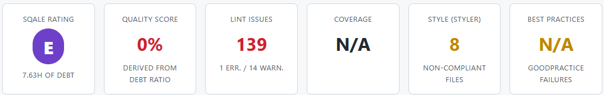{fig-align="center"}


## Version 0 — Dette technique

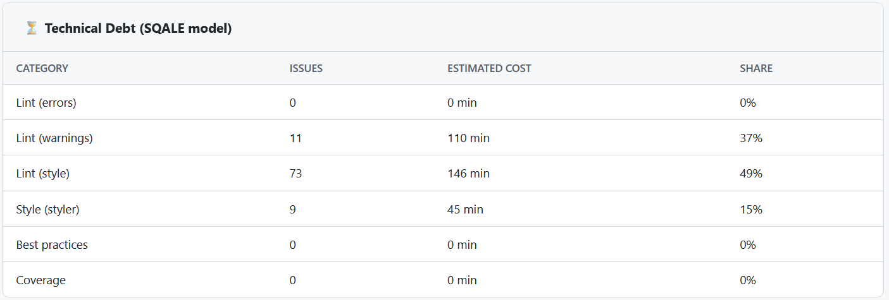{fig-align="center"}

## Version 0 — Hotspots

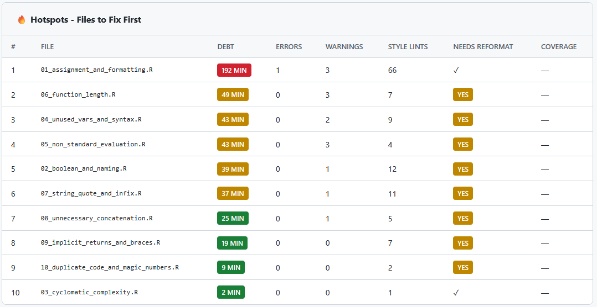{fig-align="center"}

## Version 0 — Lint issues

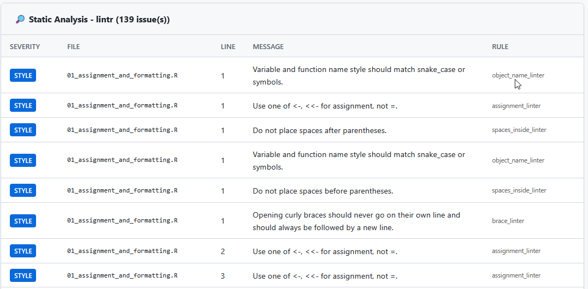{fig-align="center"}

## Étape 1 — Corriger le style automatiquement

`sonar_fix()` s'appuie sur [`air`](https://github.com/posit-dev/air), le formateur R rapide de Posit.

```{.r}
# Aperçu sans rien modifier
sonar_fix(".", dry_run = TRUE)
```

```{.r}
── rsonar Fix (dry-run) ──────────────────────────────────────────────────────────────────────────────────────────────────
ℹ Path: /var/data/nfs/CERISE/00-Espace-Personnel/damien.dotta/rsonar_tests
ℹ 10 R file(s) found
✔ Report saved: sonar-fixes.json
                               
── rsonar Fix Report (dry-run - no files modified) ───────────────────────────────────────────────────────────────────────
ℹ Path : /var/data/nfs/CERISE/00-Espace-Personnel/damien.dotta/rsonar_tests
ℹ Files : 10 scanned, 10 modified
ℹ Time : 1.8s
                               
── Fixes applied               
  styler: 8fixes to 10 file(s)
  spacing: 3
  true_false: 3
  commas: 1
  cleanup: 35
  assignment: 4
  unused_vars: 3
ℹ Run `sonar_fix()` with `dry_run = FALSE` to apply fixes.
✔ Applying fixes to 10 file(s) [2s]
```

## Étape 1 — Corriger le style automatiquement

Avec dry_run à FALSE, les scripts sont modifiés :  
  
```{.r}
# Application des corrections de style
sonar_fix(".", dry_run = FALSE)
```


## Version 1 — Résultat

```{.r}
# File 1: Assignment operator & formatting issues
Part_SAU = function( SAU_HA = 80 , surface_totale = 100 , unused_arg = 10 ){

  if( SAU_HA == NA || surface_totale == NA || SAU_HA == NULL ){ return( NULL ) }

  for( i in 1:length( SAU_HA ) ){ print( i ) }

  msg = paste( "Part SAU: " , SAU_HA , sep = "" )

  if( class( SAU_HA ) == "numeric" ){ warning( msg ) }

  if( SAU_HA > 0 && surface_totale > 0 ){
    res <- ( SAU_HA / surface_totale ) * 100
  }

  return( round( res , 1 ) )

  print("Fini"
        }
```

C'est mieux mais tout n'est pas réglé.

## Version 1 — Résultats

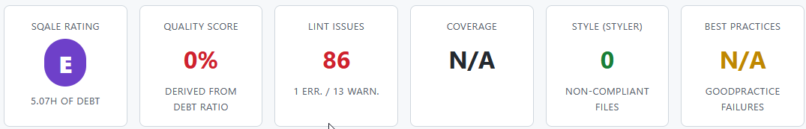{fig-align="center"}

Sur notre script exemple :  
  

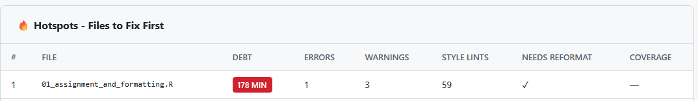{fig-align="center"}

## Version 2 — Refactoriser/documenter

Améliorations manuelles :

- renommer `Part_SAU` → `calculer_part_sau` et `SAU_HA` → `sau_ha` (snake_case)
- remplacer `SAU_HA == NA` → `is.na()` et `class() == "numeric"` → `is.numeric()`
- supprimer la boucle `for (i in 1:length(...)) print(i)`
- corriger l'erreur de syntaxe `print("Fini"` et revenir au retour implicite
- ajouter la documentation **roxygen2**

## Version 2 — Refactoriser/documenter

```{.r}
#' Calculer la part de Surface Agricole Utile (SAU)
#'
#' @param sau_ha Numérique ou vecteur numérique. La SAU en hectares.
#' @param surface_totale Numérique ou vecteur numérique. La surface totale en ha.
#'
#' @return La part de SAU en pourcentage.
#' @export
calculer_part_sau <- function(sau_ha = 80, surface_totale = 100) {
  if (is.null(sau_ha) || is.null(surface_totale)) {
    return(NULL)
  }

  if (any(is.na(sau_ha)) || any(is.na(surface_totale))) {
    return(NULL)
  }

  if (any(sau_ha < 0) || any(surface_totale <= 0)) {
    stop("Les surfaces doivent être positives et la surface totale > 0.")
  }

  res <- (sau_ha / surface_totale) * 100

  if (any(res > 100)) {
    warning("Au moins une valeur de SAU dépasse la surface totale.")
  }

  return(res)
}
```

## Version 2 — Refactoriser/documenter

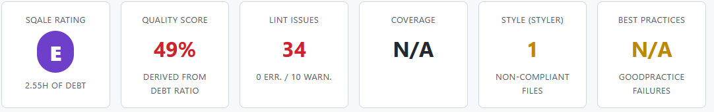{fig-align="center"}

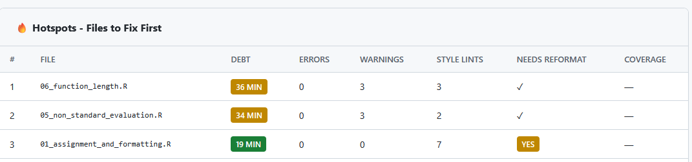{fig-align="center"}

## Version 3 — Ajouter des tests

`tests/testthat/test-calculer-part-sau.R` :

```{.r}
library(testthat)

test_that("calculer_part_sau calcule la part de SAU sur un vecteur", {
  res <- calculer_part_sau(sau_ha = c(80, 120), surface_totale = 200)

  expect_equal(res, c(40, 60))
})

test_that("calculer_part_sau applique les valeurs par défaut", {
  res <- calculer_part_sau()

  expect_equal(res, 80)
})
```

## Version 3 — Ajouter des tests (1/2)

```{.r}
res <- sonar_analyse(".",include_coverage = FALSE)
```

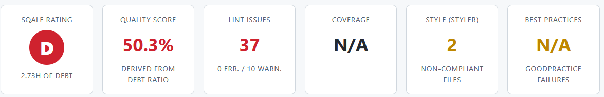{fig-align="center"}

## Version 3 — Ajouter des tests (2/2)

```{.r}
res <- sonar_analyse(".")
```

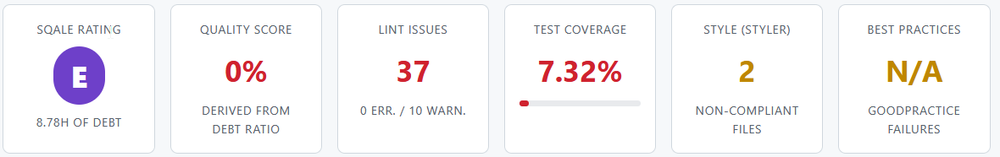{fig-align="center"}


## Pourquoi le score tombe à 0 % ?

`sonar_analyse(".")` **sans** `include_coverage = FALSE` mesure la couverture dès qu'un dossier `tests/` existe. Ici, elle n'est que de **7 %** : une seule fonction est testée sur les 10 scripts.

La pénalité de couverture s'applique alors :

```text
(80 − 7) × 5 = 365 min
```

Cette pénalité dépasse à elle seule l'effort de référence (11 fichiers × 30 = 330 min) :

```text
ratio = dette / 330 ≥ 1
score = 100 × (1 − 1) = 0 %
```

→ **Score 0 % · Note E**. C'est la couverture **globale** du projet qui compte, pas celle d'un seul fichier.

## Version 4 - Dépôt complet avec tests et couverture élevée
 
- Voir [ce dépôt](https://gitlab.com/ddotta/rproject_for_rsonar_with_tests) pour obtenir un projet R complet avec tests et couverture trés élevés.

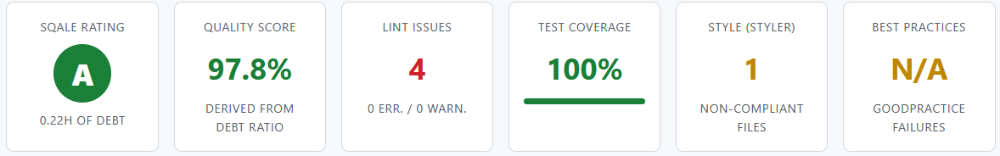{fig-align="center"}

## La progression en un coup d'œil

| Étape | Action | Score | Note | Couverture | Lint issues |
|---|---|---|---|---|
| 0 | Code initial | 0 % | E | 0 % | 139 |
| 1 | Style auto (`sonar_fix`) | 0 % | E | 0 % | 86 |
| 2 | Refactorisation + doc | 49 % | E | 0 % | 34 |
| 3 | Tests ajoutés sans pénalité | 50 % | D | 0 % | 37
| 3 | Tests ajoutés avec pénalité | 0 % | E | 7 % | 37
| 4 | Dépôt complet | 98 % | A | 100 % | 4

Chaque amélioration fait monter le score et baisser la dette.

## A propos de la couverture

::: {.callout-note title="Pourquoi la couverture ne bouge qu'à l'étape 3 ?"}
La couverture n'est **mesurée** que lorsqu'il existe des tests. Avant (étapes 0 à 2), elle vaut 0 % et n'engendre **aucune pénalité**. À l'étape 3, mesurer la couverture (**7 %**) déclenche la pénalité `(80 − 7) × 5 = 365 min`, qui fait retomber le score à **0 %**.

⚠️ Pour l'éviter, il faut couvrir **tout le projet** (couverture ≥ 80 %), pas une seule fonction. Sinon, c'est la couverture **globale** qui fait chuter le score.
:::


## Aller plus loin : automatiser les corrections

Le package `rsonar` peut être intégré dans un pipeline CI/CD pour automatiser la mesure de la qualité et le reformatage du code. Voir [ce dépôt](https://gitlab.com/ddotta/rproject_for_rsonar)

**Résultat :** plus besoin de reformater son code à la main avant de commiter, ni de faire des allers-retours en revue de code sur de simples questions de style. Un développeur déclenche le job, et une MR toute prête arrive avec le diff de mise en forme et il ne reste plus qu'à la relire et la fusionner.

## Exemple de pipeline CI (GitLab)

- Voir [ce dépôt](https://gitlab.com/ddotta/ci-templates-r)  

Extrait minimal de `.gitlab-ci.yml` :  

```yaml
stages: [quality, autofix]

rsonar-check:
  stage: quality
  script: R -e "sonar_analyse('.'); export_junit()"

rsonar-fix:
  stage: autofix
  when: manual
  script: R -e "sonar_fix('.', create_mr = TRUE)"
```

## Suivre l'évolution dans le temps

```{.r}
# Comparer deux analyses (avant / après)
sonar_diff(res_v3, res_v0)

# Historiser les scores pour tracer la tendance
sonar_trend(res, file = "rsonar-history.json")
```

- `sonar_diff()` : nouveaux problèmes, problèmes corrigés
- `sonar_trend()` : courbe d'évolution de la note

## Exporter les résultats (CI)

```{.r}
export_junit(res, "junit-results.xml")      # GitLab/Jenkins
export_sarif(res, "results.sarif")          # GitHub Code Scanning
export_sonar_json(res, "sonar-issues.json") # SonarQube
```

Formats standards : JUnit XML, SARIF 2.1.0, SonarQube Generic Issue Import.

## Ce qu'il faut retenir

`rsonar` = mesurer, corriger, sécuriser :

- **Localement** : `quality_score()` et `debt_index()` pour un feedback immédiat
- **En profondeur** : `sonar_analyse()` + `sonar_report()` + `sonar_hotspots()`
- **Dans la durée** : `sonar_diff()` / `sonar_trend()` pour voir la note progresser
- **En CI** : `quality_gate()` + exports + `sonar_fix(create_mr = TRUE)`


---

Documentation : [ddotta.github.io/rsonar](https://ddotta.github.io/rsonar/) · [intégration CI/CD](https://ddotta.github.io/rsonar/articles/ci-integration.html)